# Airia Firmware Review

## Basic Info

- Release Version: `1.9.4`
- Build Date: `11/14/2019`
- Review Period: `11/18/2019 thru 11/22/2019`

## Background

We (Alchemy Firmware Team) were asked to look through the latest AIRIA code to provide our perspective and analysis in an effort to try and provide some help where possible along with transparency for the members of the Alchemy HomeCare Team. We were provided with the latest AIRIA code at the time (1.9.4). This document are the results of this short analysis.

## Code Overview

The following sections are informational and were produced as we worked our way through the codebase to understand the structure better.

### Unrolling the Main Loop

There are two main loops in the codebase, one is the loop from the entry point of the software, and the other is a "loop" implemented in the ARM Systick timer interrupt routine which triggers every millisecond. The latter is considered the primary loop.

Pseudocode: Main Loop

```C

init(); // HAL, Peripherals, AWS, Device Init

while(1) 
{
    delay(10); // Allows airia loop to execute below

    if(!initializing && !jetting)
    {
        amazon_loop();
        check_alexa_connections(...);

        if(I2C is available)
        {
            // update bottom LED
            // update top LEDs
        }

        log_metrics();
    }

    get_cartridge_state();

    if(cartridge_error)
        // Log Cartridge Error
}


```

Pseudocode: Main Airia Loop ("The Real Main")

```C

// Note: this is triggered by systick ISR
// Do things depending on the current status (Refer to status table below)

switch(status)
{
    case ST_REFCHECK, ST_RESETREQ:

        // Turn off Cartridge power, low power, fan

        if(ST_REFCHECK && Cartridge is removed)
            // Try to flush Cartridge values to EEPROM

        else if(ST_RESETREQ)
            if(Cartridge present)
                // Update to ST_NOREFILL
        
    case ST_FATALER:

        if (2 weeks are expired) {
            if (intensity button pressed)
                // Upload 2 Week time
            else
                // Turn off LEDs
        }

        if (Cartridge Error and Cartridge not present) {
            // Turn off Cartridge power, low power, fan, LEDs
            // Fix refill extraction during jetting issue
        }
            
    case ST_ACTIVE:

        // Over the course of 5 seconds...
        read_voltage_average();

        if (voltage ON)
            // check error of ALWAYS_ON
        else {
            // ensure SUBH is off
            // turn on Low Power
            // slowly enable High power
        }

        // Check if Voltage is OK
        // Turn on Jetting (Burst length, frequency)
        // Check and Adjust Fan Speed
        
    case ST_PAUSE:

        // Update LEDs

    case ST_NOJETTING:

        // Check Cartridge Error and Log

        if(!ST_ACTIVE)
            // Turn Off High power

        // Check for factory reset
        // Check user guide
        // Check cartridge state
        // Check on/off button

    case ST_NOREFILL:

        // Update LEDs
        if (cartridge inserted)
            // update to ST_REFCHECK

    case ST_EOLR:

        if (cartridge is empty)
            // update to ST_NOREFILL
}

```

### Status Codes

These codes reflect the main status of the device at any point during operation. These aren't the only status indicators, but the ones used heavily in the main loop.

| Define       | Description |
|--------------|-------------|
| ST\_NOINIT   | Uninitialized |
| ST\_HWINIT   | Hardware initialised |
| ST\_REFINIT  | Refill initialization |
| ST\_ONOTA    | On OTA mode |
| ST\_REFCHECK | Refill check |
| ST\_ACTIVE   | Active mode |
| ST\_PAUSE    | Pause mode |
| ST\_NOJETTING| Scent turned off |
| ST\_FATALER  | Fatal error detected |
| ST\_DIAGN    | Diagnostic request |
| ST\_RESETREQ | A reset is required |
| ST\_NOREFILL | No refill inserted |
| ST\_EOLR     | Refill end of life |

### Source Catalog

The codebase is broken up into 3 sections:

- Airia
- Heatwave
- Amazon

The following tables list file names and descriptions, as well as lines of code. I have omitted the Amazon code since there are a lot of files, and most of these are part of the SDK and unchanged. Amazon changes seem to be handled through configuration header files.

Airia

| File                | Description | Length (# lines) |
|---------------------|-------------|------------------|
| Airia.c             | Module 1 (M1) Airia main program and initialization. | 856 |
| Led.c               | Module 2 (M2) Leds management | 803 |
| Switches.c          | Module 3 (M3) Pushbuttons and switches management  | 231 |
| Module\_Interface.c | Module interface routines | 211 |

Heatwave

| File                | Description | Length (# lines) |
|---------------------|-------------|------------------|
| Refill.c            | Module 4 (M4) Refill management | 1189 |
| InkJetFalcon.c      | Module 4 (M4) Refill management | 1181 |
| Tnd.c               | Module 4 (M4) Refill management | 1070 |
| Diagnostic.c        | Module 10 (M10) Diagnostic management | 600 |
| M5\_M6\_M7.c        | Module 5, 6 & 7 (M5, M6, M7) Timers, Pwm and ADC management | 305 |
| Eeprom.c            | Module 8 (M8) Non volatile memory management | 180 |
| Uart.c              | Uart management routines | 60 |

Amazon

...

### Supported ACK Capabilities

- BRIGHTNESS\_CONTROLLER (Bottom LED intensity)
- COLOR\_CONTROLLER (Bottom LED color)
- MODE\_CONTROLLER 
- POWER\_CONTROLLER (Device ON/OFF)
- RANGE\_CONTROLLER (Perfume Level)
- TOGGLE\_CONTROLLER (Bottom LED ON/OFF)
- DASH\_REPLENISHMENT
- HOST\_FIRMWARE\_UPDATE
- LOGGING
- METRICS
- MODULE\_DIAGNOSTICS

## Hardware

To understand the hardware layout and construction, we have provided some basic documentation of the separate PCBs, including photos, annotations, and descriptions.

### Functional Block Diagram


### Photos

- Main PCB (Front)

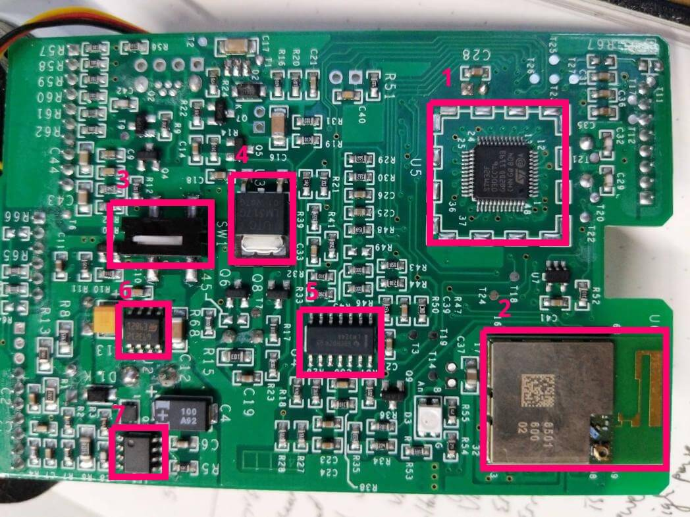

Sits vertical in Airia body right up against the cartridge housing.

| Annotation | Description | Link |
|------------|-------------|------|
| 1          | Main Microcontroller. STM32F 030CCT6 | https://www.mouser.com/datasheet/2/389/stm32f030f4-956260.pdf |
| 2          | Alexa Connect Kit (ACK) | https://developer.amazon.com/docs/ack/overview.html |
| 3          | Cartridge Switch. Used to detect if cartridge is present. | |
| 4          | LM317G: Voltage Regulator | http://www.ti.com/lit/ds/slvs044x/slvs044x.pdf |
| 5          | LM324A: Operational Amplifier | http://www.ti.com/lit/ds/symlink/lm324a.pdf |
| 6          | L6932D1: Linear Voltage Regulator | shorturl.at/syJNR |
| 7          | LM3478: N-channel controller for switching regulator | http://www.ti.com/lit/ds/symlink/lm3478.pdf |

- Main PCB (Back)

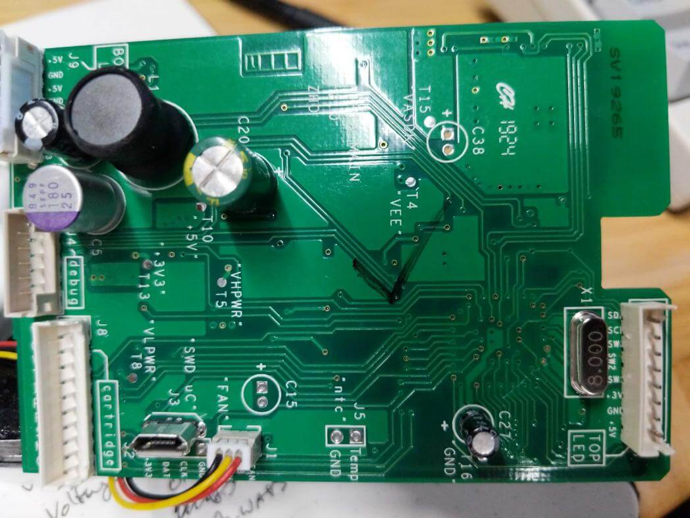

- Top PCB (Front)

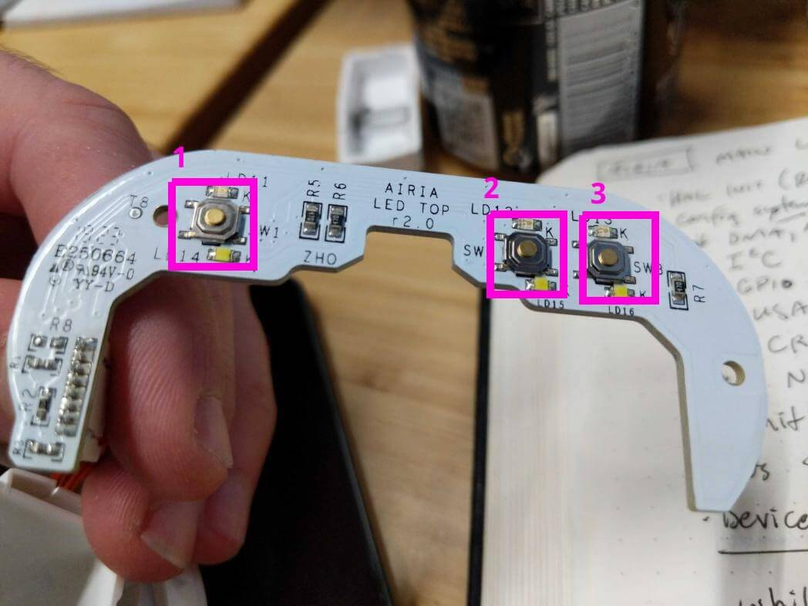

Sits horizontal on top of the Airia right under buttons.

| Annotation | Description | Link |
|------------|-------------|------|
| 1          | On/Off Button | |
| 2          | Intensity (-) Button | |
| 3          | Intensity (+) Button | |

- Top PCB (Back)

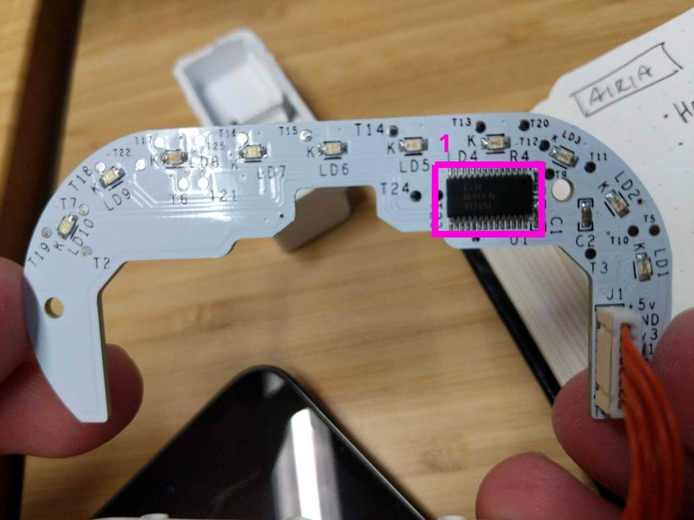

| Annotation | Description | Link |
|------------|-------------|------|
| 1          | TLC59116: 16 Channel I2C LED Sink Driver | http://www.ti.com/lit/ds/symlink/tlc59116.pdf |

- Bottom PCB

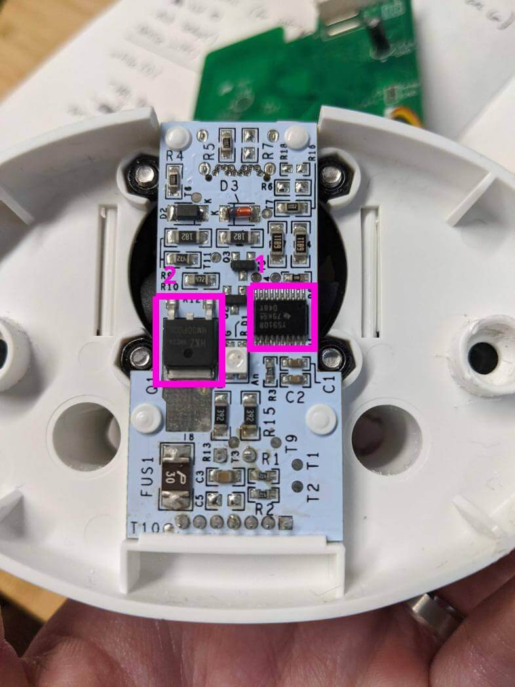

Sits at the very button right under fan and blower module.

| Annotation | Description | Link |
|------------|-------------|------|
| 1          | TLC59108: 8-Bit I2C LED Sink Driver | http://www.ti.com/lit/ds/symlink/tlc59108.pdf |
| 2          | Unknown | |

- Fragrance Cartridge (Front View)

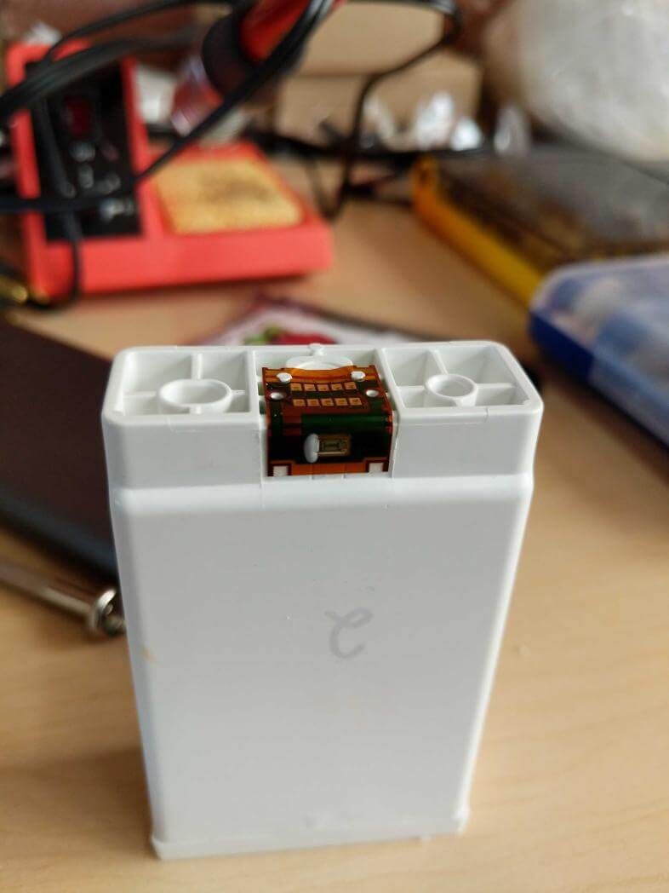

- Fragrance Cartridge (Top View)
 


- Fan (Distributes fragrance)

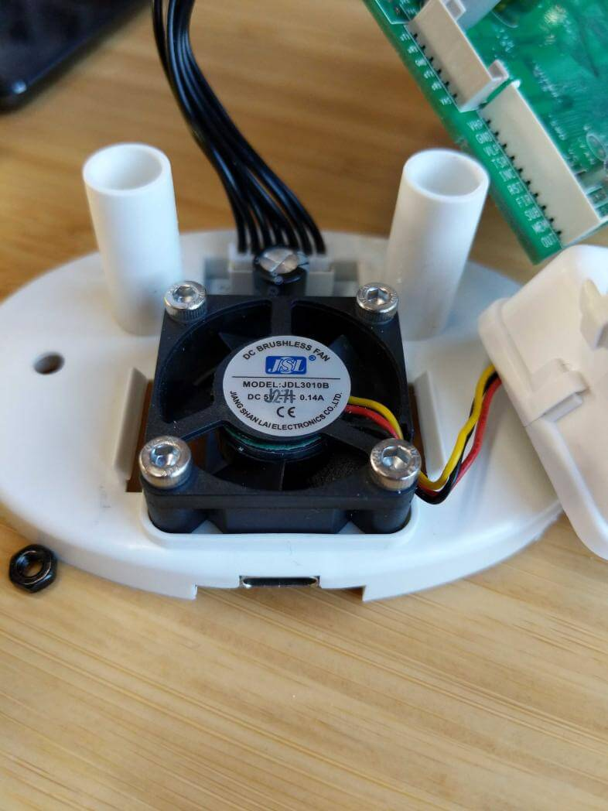

- Blower Housing

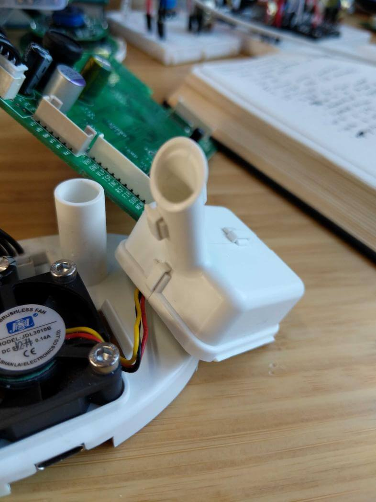

## Miscellaneous Reference

### Device troubleshooting

| Module status | ON/OFF | - BUTTON | + BUTTON |
|---------------|--------|----------|----------|
| UNAVAILABLE                  | OFF | ON | ON |
| BOOTED                       | OFF | ON | ON |
| FACTORY\_RESET\_IN\_PROGRESS | OFF | ON | ON |
| IN\_SETUP\_MODE              | OFF | ON | ON |
| NOT\_REGISTERED              | OFF | ON | ON |
| NOT\_CONNECTED\_TO\_ALEXA    | OFF | ON | ON |
| CONNECTED\_TO\_ALEXA         | OFF | ON | ON |

### Color Adjustment

It appears that the resistance values chosen for the red, green, and blue LED channels on the Bottom PCB are causing unexpected apparent colors when blending via Pulse Width Modulation.

This necessitates the use of a conversion table, to use different RGB values for the PWM IC to try to achieve the target RGB values.

Below is a comparison of the target colors, and the adjusted color values to achieve the same apparent result.

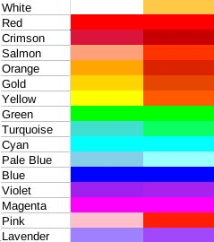

If you look at the needed alteration by channel, you'll notice that the red channel doesn't require much altering where the green and blue channels require significant altering in some cases. This also isn't helped by the clear diffuser, which doesn't mix the three channels together very well.

For the colors that require full duty (255) only, they shouldn't require alteration since there is no "mixing" needed. These colors would be White, Red, Blue, Green, Magenta, Yellow, and Cyan. However, White and Yellow appear to require some adjustment. And this may be more attributed to the diffuser than the LED itself.

| Color Name | Target RGB    | Adjusted RGB | Difference |
|------------|---------------|--------------|------------|
| White      | 255, 255, 255 | 255,200, 70  |  0, 55,185 |
| Red        | 255,   0,   0 | 255,  0,  0  |  0,  0,  0 |
| Crimson    | 219,  20,  60 | 200,  0,  1  | 19, 20, 59 |
| Salmon     | 255, 160, 122 | 255, 50,  0  |  0,110,122 |
| Orange     | 255, 166,   0 | 220, 35,  0  | 35,131,  0 |
| Gold       | 255, 213,   0 | 230, 70,  0  | 25,143,  0 |
| Yellow     | 255, 255,   0 | 255, 90,  0  |  0,165,  0 |
| Green      |   0, 255,   0 |   0,255,  0  |  0,  0,  0 |
| Turquoise  |  63, 224, 208 |  10,255,100  | 53,-31,108 |
| Cyan       |   0, 255, 255 |   0,255,255  |  0,  0,  0 |
| Pale Blue  | 135, 206, 234 | 153,255,255  |-18,-49,-21 |
| Blue       |   0,   0, 255 |   0,  0,255  |  0,  0,  0 |
| Violet     | 160,  33, 239 | 167, 33,239  | -7,  0,  0 |
| Magenta    | 255,   0, 255 | 255,  0,255  |  0,  0,  0 |
| Pink       | 255, 191, 204 | 255, 30,  5  |  0,161,199 |
| Lavender   | 159, 128, 255 | 162, 72,250  | -3, 56,  5 |

Here is another visual showing all named colors with R, G, B and adjusted R, G, and B.

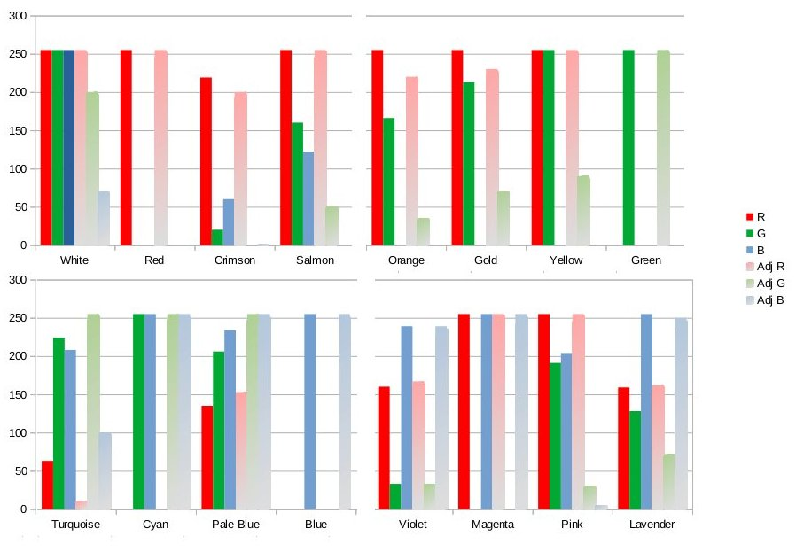

## Bug Reports

These are bugs we verified and pursued finding explanations in the code.

1. Yellow color is too orange
2. Toggling the fragrance on causes the reported color to change to Purple
3. Light is getting turned on by turning on fragrance

```
Notes about 3.
- This bug is repeatable the first time the device boots and the fragrance is turned on through app.
- We're sometimes able to repeat this bug after turning off MASTER POWER in Alexa App and then turning fragrance on.
```

## Recommendations

### General Structure

Consider pulling most of the code from the Systick timer interrupt and putting it into main(). In general, interrupts should return as quickly as possible.

There a couple of concerns with doing too much in Systick:

1. The code could potentially take more than 1 millisecond and throw off timing logic inside loop.
2. Spending too much time in the interrupt can trigger WDT if setup with a reasonable short interval

### Hardware Changes

#### Utilizing two I2C interfaces

Currently it appears I2C1 is used for Top LEDs, Bottom LED, and Refill Management. There is a noticible stutter in the bottom LED when waiting for I2C line to be free. I am not certain if there are more pins to connect I2C2 to bottom PCB, but it would alleviate this issue potentially.

#### Adjusting Resistors on RGB LED channels

Without seeing a PCB schematic, it's hard to tell what resistances are currently on the board. But this is likely an obvious candidate for improvement.

### Bug Fixes

#### 1. Yellow color is too orange

- Airia/Inc/Airia_Headers/Colours.h

```C
// Yellow
#define YELLOW_R_VAL    255 // Red color value
#define YELLOW_G_VAL    150 // Green color value
#define YELLOW_B_VAL    0   // Blue color value
```

The image below shows the before (Left) and after (Right).

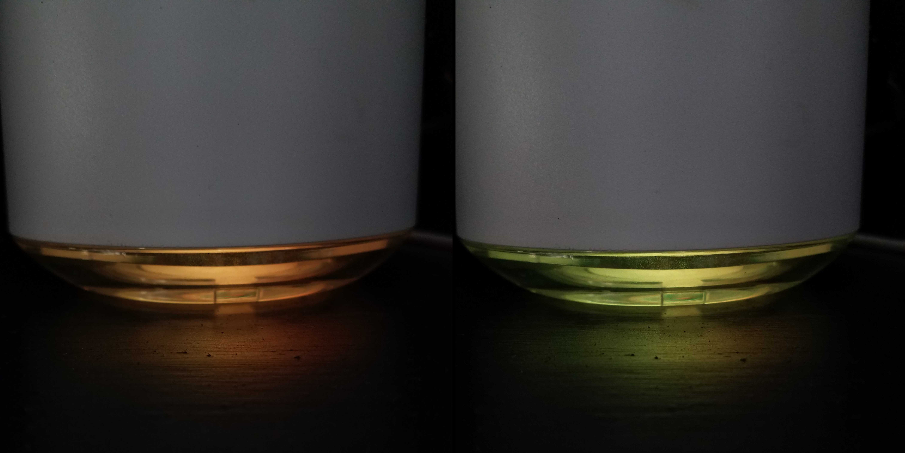

#### 2. Toggling the fragrance on causes the reported color to change to Purple

- Airia/Inc/Airia_Headers/Structs.h

Save the HSV values to the STATUS_STR struct.

```C
...
    double h; // hue
    double s; // saturation
    double v; // brightness
} STATUS_STR;
```

Save the HSV values to the SAVE_PARAM_STR struct.

```C
...
    double h;
    double s;
    double v;
} SAVE_PARAM_STR;
```

- Airia/Src/Amazon_Code/ACKApplication/AlexaCapabilities.c

Change this function to use the HSV values from the SAVE_PARAM_STR struct. The bug was occurring here. Every time the SAVE_PARAM_STR was read from memory, the reported color was set to the default (violet).

```C
void Set_G_Hardware_Values(SAVE_PARAM_STR *Save_Params_Ptr)
{
    // Set up hardware to initial state, for hardware for which values of 0 are not meaningful.
    g_hardware.ColorTemperature = COLOR_TEMPERATURE_MIN;
    // g_hardware.Color.Hue = 277;
    // g_hardware.Color.Brightness = 0.8619;
    // g_hardware.Color.Saturation = 0.93730000000000002;
    g_hardware.Color.Hue = Save_Params_Ptr->h;
    g_hardware.Color.Saturation = Save_Params_Ptr->s;
    g_hardware.Color.Brightness = Save_Params_Ptr->v;
    g_rangeStates[0].Value = Save_Params_Ptr->Intensity_Cnt;
    g_hardware.Brightness = Save_Params_Ptr->RGB_Bright;
}
```

When a new color is sent to the mcu, update the global status.

```C
void ACKUser_ColorControllerDirective(int32_t correlationId, double hue, double saturation, double brightness)
{
...
    if (changed)
    {
        pOutboundEvent->ChangeReportPayloadPropertyBits = pOutboundEvent->PropertyBits;
        // Airia HSB to RGB conversion
        HSV2RGB(g_hardware.Color.Hue, g_hardware.Color.Saturation, g_hardware.Color.Brightness, G_Status_Ptr);
        G_Status_Ptr->Led.Color_Changed = 1; // Set the colour changed flag
        G_Status_Ptr->h = hue;
        G_Status_Ptr->s = saturation;
        G_Status_Ptr->v = brightness;
    }
}
```

- Airia/Src/Heatwave_Code/Eeprom.c

Set the default h,s,v values to violet.

```C
void Get_Saved_Param(STATUS_STR *Status_Ptr)
{
    __uint8_t ChkSum = 0;
    Save_Params_Ptr = &Saved_Params;
    Save_Params_Ptr->Saved = 0;
    Save_Params_Ptr->Intensity_Cnt = 0;
    Save_Params_Ptr->RGB_Bright = 0;
    Save_Params_Ptr->RGB_Color[R_VALUE] = DEFAULT_R_VAL;
    Save_Params_Ptr->RGB_Color[G_VALUE] = DEFAULT_G_VAL;
    Save_Params_Ptr->RGB_Color[B_VALUE] = DEFAULT_B_VAL;
    Save_Params_Ptr->RGB_Prev_Color[R_VALUE] = DEFAULT_R_VAL;
    Save_Params_Ptr->RGB_Prev_Color[G_VALUE] = DEFAULT_G_VAL;
    Save_Params_Ptr->RGB_Prev_Color[B_VALUE] = DEFAULT_B_VAL;
    Save_Params_Ptr->Light = 0;
    Save_Params_Ptr->Scent = 0;
    Save_Params_Ptr->h = 277;
    Save_Params_Ptr->s = 0.8619;
    Save_Params_Ptr->v = 0.9373;
...
}
```

Save the h,s,v values.

```C
void Write_Param_To_Save(STATUS_STR *Status_Ptr)
{
    if (Capture_EEW_Semaphore (Status_Ptr) == 1) {
        if (Status_Ptr->Save_Parameter == 1) {
            Save_Params_Ptr = &Saved_Params;
            Save_Params_Ptr->Saved = SAVED;
            Save_Params_Ptr->Intensity_Cnt = Status_Ptr->Intensity_cnt ;
            Save_Params_Ptr->RGB_Bright = Status_Ptr->Led.RGB_Bright;
            Save_Params_Ptr->RGB_Color[R_VALUE] = Status_Ptr->Led.RGB_Color[R_VALUE];
            Save_Params_Ptr->RGB_Color[G_VALUE] = Status_Ptr->Led.RGB_Color[G_VALUE];
            Save_Params_Ptr->RGB_Color[B_VALUE] = Status_Ptr->Led.RGB_Color[B_VALUE];
            Save_Params_Ptr->RGB_Prev_Color[R_VALUE] = Status_Ptr->Led.RGB_Prev_Color[R_VALUE];
            Save_Params_Ptr->RGB_Prev_Color[G_VALUE] = Status_Ptr->Led.RGB_Prev_Color[G_VALUE];
            Save_Params_Ptr->RGB_Prev_Color[B_VALUE] = Status_Ptr->Led.RGB_Prev_Color[B_VALUE];
            Save_Params_Ptr->Light = Status_Ptr->Light;
            Save_Params_Ptr->Scent = Status_Ptr->Scent;
            Save_Params_Ptr->h = Status_Ptr->h;
            Save_Params_Ptr->s = Status_Ptr->s;
            Save_Params_Ptr->v = Status_Ptr->v;
...

}
```

#### 3. Light is getting turned on by turning on fragrance

- Airia/Src/Amazon_Code/ACKApplication/AlexaCapabilities.c

Possible cause may be related to the part of this function where 'G_Status_Ptr->Light = L_ON'.

```C
void ACKUser_ToggleControllerDirective(int32_t correlationId, uint32_t instance, bool state)
{
...
    switch(instance)
    {
...
        case 11:
        // Airia perfume On/Off
        // The only way to stop the perfume is to put the device into pause, or increase the idle time to the max
        // that are 1193 hours. But pressing the + or - buttons we will have a timing change
        // Using the pause we have a problem with the light turn on/off because in pause it must be always off
        // We could use a flag  that enable or disable the jetting (idle time)
        if ( state) {
            switch (G_Status_Ptr->Status) {
                case ST_PAUSE:	//Scent On/Light Off/Master On
                    G_Status_Ptr->Scent = 1;
                    //G_Status_Ptr->Light = L_OFF;
                    Device_On(G_Status_Ptr, false);
                    G_Status_Ptr->Metrics_Logs.Metrics[ON_METRIC] = 1;
                    break;
                case ST_NOJETTING: // Scent On/Light On/Master On
                    G_Status_Ptr->Scent = 1;
                    if (G_Status_Ptr->ByMasterSw == 1)		// Command arrived by the app or device On/Off button
                        G_Status_Ptr->Light = L_ON;
...
}
```

## Future State

In our short experience with the AIRIA device we found it antagonistic from the setup having to install two mobile apps, and switch back and forth between both apps, to relying on Wi-Fi and chip-to-chip communication for simple things such as changing light color or fragrance intensity.

We would recommend replacing both the STM32 MCU and ACK Chip with an ESP32 chip. This is an inexpensive Wi-Fi+Bluetooth SoC and we have a lot of experience with this chip along with a mature codebase. Many of the code modules that we have written already could be reused, such as BLE GATT server, Wi-Fi, AWS publishing, LED code, etc... The Heatwave code could be almost reused entirely on the new SoC as well.

Utilizing BLE in the app for short range communication with the device and only using Wi-Fi communication (MQTT messages to IoT platform) when out-of-range would provide a snappier experience for the user.

This would also allow us to leverage the IoT platform built in-house at Alchemy, tighter team communication, and faster iteration.

